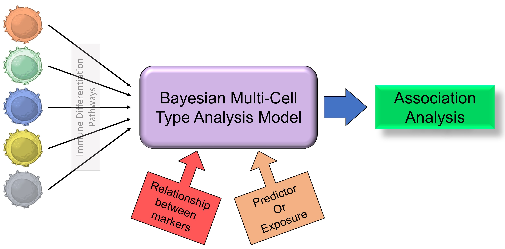
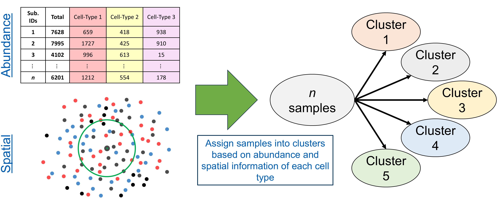
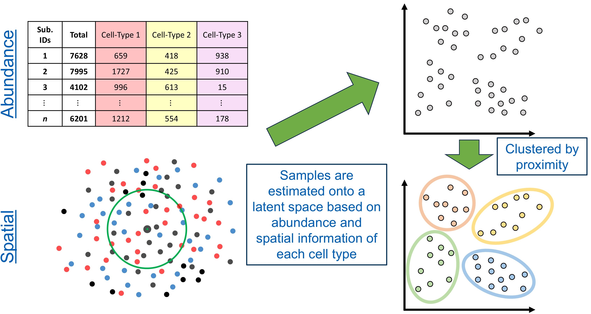
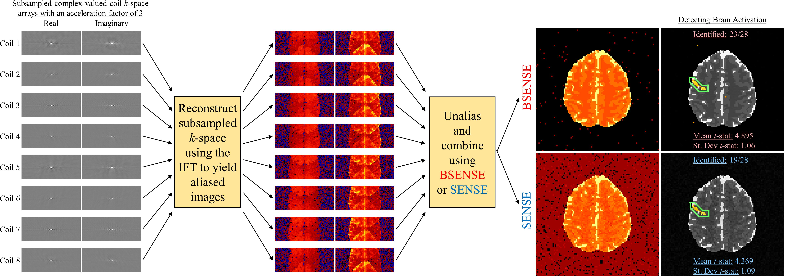
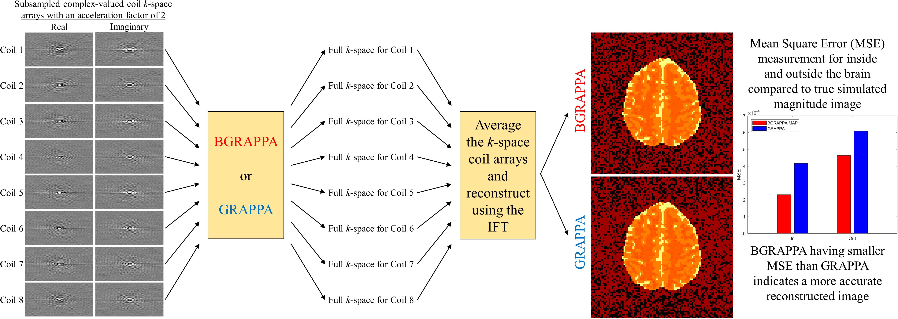
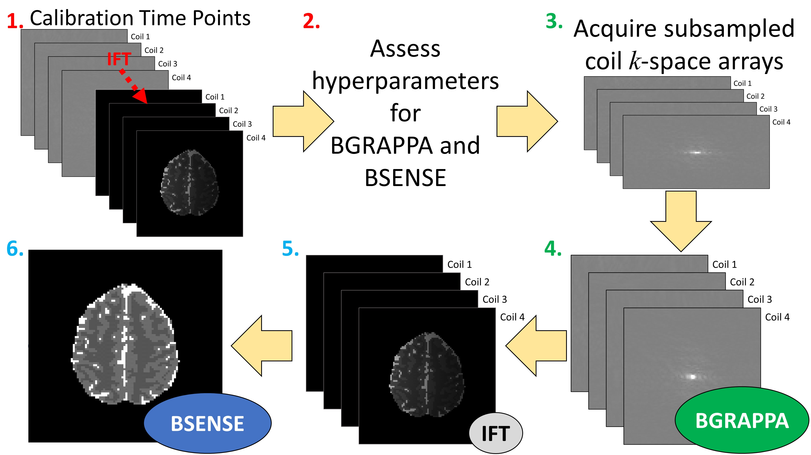

<!----------------------->
<!-- Spatial Proteomic -->
<!----------------------->

### Spatial Proteomics

Spatial Proteomic Imaging Data Analysis

<!-- Background -->

#### Background

Background

Epithelial ovarian cancer (EOC) is one of the most lethal gynecologic malignancies and is frequently diagnosed at an advanced stage. Despite improvements in surgical and chemotherapeutic approaches, most patients ultimately experience disease recurrence or develop treatment resistance, highlighting the need for improved therapeutic strategies. A key component in the development of targeted therapies is a deeper understanding of the tumor microenvironment (TME), the complex ecosystem of immune, stromal, and tumor cells that influences disease progression and treatment response.

Recent advances in fluorescence-based imaging technologies, such as multiplex immunofluorescence (mIF) imaging, have enabled comprehensive characterization of the TME at single-cell resolution. Following image acquisition, cellular segmentation and immune phenotyping techniques can be applied to identify and classify individual cells within the tissue specimen. These data provide detailed measurements of immune cell abundance, phenotype, and spatial organization, allowing investigators to study not only the composition of the TME but also the spatial relationships among cellular populations. Statistical analysis of these spatial patterns can improve our understanding of tumor biology, identify prognostic biomarkers, and provide insights that may inform treatment decisions and improve patient outcomes.

<!-- Bayesian Multi-Cell Type Analysis Model -->

#### Bayesian Multi-Cell Type Analysis

Bayesian Multi-Cell Type Analysis Model

Traditional analyses of the TME often evaluate individual immune cell populations separately, ignoring the biological relationships that exist among cell types. However, immune cells arise through complex differentiation pathways and frequently exhibit correlated abundance patterns within tumors. To better capture these relationships, we developed a Bayesian multi-cell type beta-binomial modeling framework that jointly analyzes multiple immune cell populations while accounting for correlations between cell types and repeated tissue measurements from the same patient.

The proposed approach models immune cell abundance using hierarchical Bayesian methods and incorporates biologically motivated covariance structures based on immune cell differentiation pathways. Several covariance modeling strategies were investigated, including unstructured covariance models, exponential decay models based on distances along immune differentiation pathways, and tree-based covariance structures that encode known relationships among cell populations. These different covariance structures are discussed further in-depth on the <a
  href="https://fridleylab.github.io/BTIME/articles/BICAM_Cov.html"
  target="_blank"
  class="publication-title">Fridley Lab GitHub</a>. By borrowing information across related cell types, the model provides improved estimation of immune cell abundance patterns and allows investigators to identify coordinated immune signatures associated with clinical outcomes.

This methodology was applied to mIF imaging data from EOC tumors to characterize relationships between the tumor immune microenvironment and patient survival with results presented <a
  href="https://academic.oup.com/bib/article/27/1/bbag053/8471500"
  target="_blank"
  class="publication-title">here</a>. The resulting framework provides a flexible and interpretable approach for analyzing complex immune cell populations in spatially resolved imaging studies.
  

  
{width="80%" fig-align="center"}

<!-- Bayesian Clustering Models -->

#### BIFMIS

Bayesian Integrative Finite Mixture Immune Subtyping Model

Many existing approaches characterize the TME using either immune cell abundance or spatial organization independently. However, these complementary data modalities may jointly define biologically meaningful tumor subtypes.

To address this challenge, we developed a Bayesian Integrative Finite Mixture Immune Subtyping Model that simultaneously incorporates immune cell abundance measurements and spatial clustering features derived from the Degree of Clustering (DoC) framework. The proposed approach assumes that patients belong to one of several latent TME subgroups, with cluster membership governing both cellular abundance patterns and spatial organization. Immune cell abundance is modeled using a beta-binomial framework to accommodate overdispersed count data, while transformed spatial clustering measures are modeled using a Gaussian distribution.

By jointly modeling both modalities through a shared latent clustering structure, the model identifies groups of patients exhibiting similar immune composition and spatial architecture within the TME. This framework provides an interpretable approach for discovering biologically meaningful patient subgroups and facilitates investigation of how distinct tumor immune phenotypes are associated with clinical outcomes, treatment response, and disease progression.

{width="90%" fig-align="center"}

#### BILFIS

Bayesian Integrative Latent Factor Immune Subtyping Model

While finite mixture clustering approaches assign each subject to a single subgroup, biological systems often exhibit continuous heterogeneity that cannot be adequately represented through strict cluster assignments. To address this limitation, we developed a Bayesian Integrative Latent Factor Immune Subtyping Model that jointly analyzes immune cell abundance and spatial organization through a shared low-dimensional latent representation.

In this framework, immune cell abundance and spatial clustering measurements are treated as complementary views of the TME. A set of latent factors is estimated for each sample, capturing the underlying biological processes that drive variation across both data modalities. Immune cell abundance is modeled using beta-binomial distributions, while spatial clustering measurements are modeled using a Gaussian distribution. The shared latent factors link these modalities and provide a continuous representation of TME heterogeneity. By replacing finite cluster assignments with a latent factor structure, this approach allows subjects to occupy different positions within a shared biological space rather than forcing membership into predefined groups.

The resulting latent representations can subsequently be used for clustering, visualization, subject stratification, and identification of clinically relevant TME signatures associated with survival outcomes.

{width="90%" fig-align="center"}

<!-- Functional Data Analysis -->

#### Functional Data Analysis

Functional Data Analysis of Spatial Organization

The Bayesian Multi-Cell Analysis Type model focuses on immune cell abundance, while the Bayesian Integrative Immune Subtyping models incorporate both abundance and spatial organization through clustering measures evaluated at a single spatial scale. Biological interactions occurring within the TME are inherently multiscale, and spatial clustering patterns may differ substantially across short, intermediate, and long spatial distances. Consequently, analyses based on a single radius can oversimplify the underlying spatial architecture and potentially overlook clinically relevant spatial patterns.

To address this limitation, we developed a Functional Data Analysis (FDA) framework for characterizing spatial organization across a continuum of spatial scales. Building upon the <a
  href="https://cran.r-project.org/web/packages/spatialTIME/index.html"
  target="_blank"
  class="publication-title"><i>spatialTIME</i></a>
framework, spatial summary measures such as the nearest-neighbor <i>G</i> function are evaluated over a range of radii, producing subject-specific spatial clustering trajectories that describe how immune cell organization changes with distance. By treating these trajectories as functional objects rather than independent measurements at individual radii, FDA provides a principled approach for studying spatial behavior across the full range of biologically meaningful scales.

The resulting spatial trajectories are represented using smooth basis expansions and analyzed using Functional Principal Component Analysis (FPCA). FPCA decomposes spatial clustering functions into dominant modes of variation, yielding a low-dimensional representation of complex multiscale spatial behavior. In ovarian cancer studies, the leading functional principal components have been shown to capture biologically interpretable patterns such as overall clustering intensity and differences in clustering occurring at short versus long spatial distances. These functional features can subsequently be incorporated into downstream statistical models, including survival analyses, to investigate how spatial organization of immune cell populations influences patient outcomes.

<!------------------------------->
<!-- Image Reconstruction fMRI -->
<!------------------------------->

### Image Reconstruction in fMRI

Image Reconstruction in fMRI

<!-- Background -->

#### Background

Background

Functional MRI (fMRI) was developed in the early 1990’s as a technique to noninvasively observe the human brain in action. Measurements are arrays of complex-valued spatial frequencies, called $k$-space, which are approximately the Fourier transform of the image. The $k$-space arrays are reconstructed into images using an inverse Fourier transform (IFT). Measuring full arrays of data for all the slices that form the volume image takes a considerable amount of time. This limits the temporal and spatial resolution of the acquired images which can diminish effectively capturing brain activity. A solution for this is to measure less data by skipping lines in the spatial frequency arrays. This could allow for acquiring more images, obtaining higher resolution images, or simply reduce the overall scan time of the MRI process. In order to subsample $k$-space, multiple receiver coils are utilized in parallel to obtain a spatial frequency array which are reconstructed into coil-specific brain images. However, after applying the IFT to the subsampled $k$-space arrays, the images in each coil become aliased or appear as if they are "folded over." To obtain full field-of-view (FOV), the aliased coil images must be unfolded and combined to yield a full brain image. Common methods used in practice are SENSitvity Encoding (SENSE) and GeneRalized Autocalibrating Partial Parallel Acquisition (GRAPPA).

<!-- BSENSE -->

#### BSENSE

BSENSE - Bayesian SENSitivity Encoding

Traditional SENSE performs reconstruction via the relationship

 $a_c^{(\nu)} = S_c^{(\nu)} v_c^{(\nu)} + \varepsilon_c^{(\nu)},$
 $\nu = 1, ..., L$

where $a_c$ is the observed complex-valued aliased coil measurements, $S_c$ is the matrix of unobserved complex-valued coil sensitivities, $v_c$ is the unobserved complex-valued unaliased voxel values, $\varepsilon_c$ is the additive complex-valued noise, and $L$ is the total number of voxels in the full image divided by the acceleration factor yielding the total number of voxels in the aliased image. Prior to an fMRI experiment, a short non-task based set of full $k$-space volume arrays for each coil can be obtained and inverse Fourier transformed into full pre-scan coil calibration images. With an estimate of the complex-valued coil sensitivities $\hat{S}_c$ from these pre-scan calibration images, a least squares estimator of $v_c$ for each voxel is given by

 $v_c^{(\nu)} = (\hat{S}_c^{(\nu)^H} \hat{S}_c^{(\nu)})^{-1} (\hat{S}_c^{(\nu)^H} a_c^{(\nu)}),$
 $\nu = 1, ..., L$

The $\hat{S}_c$ estimated from the pre-scan calibration images is then treated as a "known" parameter and is fixed at every time point in the fMRI time series. Since the design matrix $S_c$ is generally ill-conditioned, the final reconstructed image can have degraded signal-to-noise ratio (SNR), or contain aliasing artifacts. Common approaches to mitigate this is the use of a regularizer which still introduces bias yielding a blurred image or can be computationally expensive. This motivates the use of a Bayesian approach to SENSE image reconstruction.

For the Bayesian approach, the unaliased voxels $v$, the coil sensitivities $S$, and the noise variance $\sigma^2$ are unobserved parameters that are specified with prior distributions. Combined with the data likelihood, we can formulate a conjugate, joint posterior distribution. Using all available information from the pre-scan calibration images, the priors are quantified for each unobserved parameter and assess other hyperparameters utilized for parameter estimation. Using the posterior distribution, two techniques are applied for estimating the unaliased voxels $v$, the coil sensitivities $S$, and the noise variance $\sigma^2$: Maximum <i>a posteriori</i> (MAP) estimation using the Iterated Conditional Modes (ICM) optimization algorithm to find the joint posterior mode, and marginal posterior mean estimation via Gibbs sampling.

{width=100%}

<!-- BGRAPPA -->

#### BGRAPPA

BGRAPPA - Bayesian GeneRalized Autocalibrating Partial Parallel Acquisition

GeneRalized Autocalibrating Partial Parallel Acquisition (GRAPPA) is a parallel imaging technique that yields full images from subsampled arrays of $k$-space. Unlike SENSE, GRAPPA operates in the spatial frequency domain. Before using the IFT, GRAPPA estimates the unobserved spatial frequencies, yielding full $k$-space arrays for each coil. The full $k$-space arrays are averaged and then inverse Fourier transformed into a single, full FOV brain image. GRAPPA uses localized weights to fill in the missing spatial frequencies of the subsampled $k$-space. The localized weights are assessed from pre-scan full coil calibration $k$-space. The model for the full calibration $k$-space arrays is

 $f_{calib}^{(\kappa)} = w^{(\kappa)} f_a^{(\kappa)} + η^{(\kappa)},$
 $\kappa = 1, ..., K$

where $f_{calib}$ is the observed complex-valued calibration coil spatial frequencies, $w$ is the matrix of unobserved localized weights, $f_a$ is the complex-valued spatial frequencies located in the lines of $k$-space that will be observed in the fMRI experiment, $\eta$ is the additive complex-valued noise, and $K$ is the total number of spatial frequencies in the full $k$-space array divided by the acceleration factor yielding the total number of frequencies in the subsampled $k$-space. The localized weights are assessed using a least squares estimator

 $w^{(\kappa)} = (f_{calib}^{(\kappa)} f_a^{(\kappa)^H}) (f_a^{(\kappa)} f_a^{(\kappa)^H})^{-1},$
 $\kappa = 1,..., K$

These localized weights are utilized to estimate the unobserved spatial frequencies at each point in the fMRI time series using the linear regression

 $f_e^{(\kappa)} = w^{(κ)} f_p^{(\kappa)} + \eta^{(\kappa)},$
 $κ = 1, ..., K$

where $f_e$ is the estimated complex-valued missing spatial frequencies, $w$ is the matrix of estimated localized weights, and $f_p$ is the complex-valued observed spatial frequencies, $\eta$ is the additive complex-valued noise. GRAPPA does have drawbacks such as storing and using potentially large matrices that would substantially increase reconstruction time or produce low-quality reconstructed images that would require further corrections. GRAPPA also discards valuable information from the calibration $k$-space arrays that can be used in estimating the unobserved spatial frequencies.

Due to these drawbacks, we introduce a Bayesian technique to GRAPPA (BGRAPPA) that incorporates all valuable prior information to estimate the unobserved $k$-space values. For the Bayesian technique, the GRAPPA linear regression is utilzied, but the parameters are treated differently. For BGRAPPA, fe is the observed spatial frequencies, w is the matrix of estimated localized weights, and $f_p$ is the estimated complex-valued missing spatial frequencies. The localized weights $w$, the unobserved spatial frequencies $f_p$, and the noise variance $\tau^2$ from $η \sim N(0,\tau^2I_{nC})$ are unobserved parameters that are specified with prior distributions. Combined with the data likelihood, we can formulate a conjugate, joint posterior distribution. Using all available information from the pre-scan calibration spatial frequency arrays, the priors are quantified for each unobserved parameter and assess other hyperparameters utilized for parameter estimation. The two techniques applied for estimating the localized weights $w$, the unobserved spatial frequencies $f_p$, and the noise variance $\tau^2$ are MAP estimation using the ICM optimization algorithm and the marginal posterior mean estimation via Gibbs sampling.

{width=100%}

<!-- BMUGS -->

#### BMUGS

BMUGS - Bayesian Merged Utilization of GRAPPA and SENSE

Both SENSE and GRAPPA utilize valuable information for image reconstruction, but they operate in different domains. SENSE reconstructs images in the image domain using coil sensitivity information, while GRAPPA reconstructs images in the spatial frequency domain by estimating missing <i>k</i>-space measurements. Because each approach exploits different sources of information, combining the strengths of both methods has the potential to improve image quality and downstream fMRI activation detection.

To leverage information from both domains, we developed the Bayesian Merged Utilization of GRAPPA and SENSE (BMUGS) framework. BMUGS first applies BGRAPPA to estimate the unobserved spatial frequencies in the subsampled coil-specific <i>k</i>-space arrays, yielding full coil <i>k</i>-space data. These reconstructed <i>k</i>-space arrays are then inverse Fourier transformed to generate full coil-weighted images. Finally, BSENSE is applied to the reconstructed coil images using Bayesian estimation of the coil sensitivities and voxel intensities, producing a full field-of-view, unaliased image. By integrating Bayesian reconstruction in both the spatial frequency and image domains, BMUGS utilizes all available information contained in the calibration and imaging data. This approach was shown to improve signal-to-noise ratio and increase statistical power for detecting task-related brain activation compared to existing reconstruction techniques.

{width="90%" fig-align="center"}

